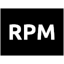
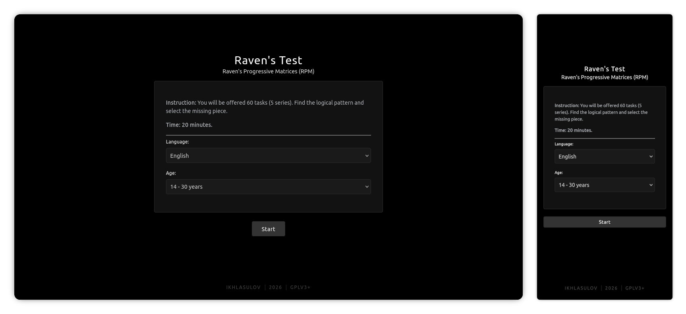

  

# Open RPM

A lightweight, browser-based implementation of Raven's Progressive Matrices (IQ Test).

## Overview

**Open-RPM** is a client-side web application designed to administer the standard Raven's Progressive Matrices test. Built using vanilla JavaScript, HTML5, and CSS3, it prioritizes performance, privacy, and accessibility without relying on external frameworks.

  

The application features an adaptive scoring algorithm that adjusts IQ estimates based on the user's age group, along with robust support for multiple languages and responsive layouts.

## Features

- **Adaptive Scoring Engine**: Calculates IQ using a normative database and spline interpolation for precision.
- **Age-Adjusted Results**: Normalizes scores based on specific demographic data (ages 14–60+).
- **Multilingual Interface**: Full localization support for English, Russian, and Indonesian.
- **Privacy Focused**: Executes entirely in the browser. No data is transmitted to external servers.
- **Responsive UI**: A clean, dark-themed interface optimized for desktop and mobile viewports.

## Algorithm Details

The scoring system utilizes a pre-defined normative distribution. Raw scores are converted to a base IQ using cubic spline interpolation. The final score is then adjusted by an age percentage factor to comply with standard psychometric practices.

  

Reliability is calculated by comparing the user's performance in Series A (the easiest series) against expected deviations. Significant anomalies may flag the result as potentially unreliable due to misunderstanding or inattention.

## Documentation

The logic, normative data, and scoring standards of this test are strictly derived from the clinical manual:

- [Тест Равена. Шкала прогрессивных матриц](README/Тест_Равена._Шкала_прогрессивных_матриц..pdf)

This document contains the detailed breakdown of the 5 series, correct answer keys, normative distributions, and IQ conversion tables used in this application.

## License

This project is licensed under the **GNU General Public License v3.0 or later**. See the [LICENSE](LICENSE) file for details.

## Contributing

Contributions are welcome.
